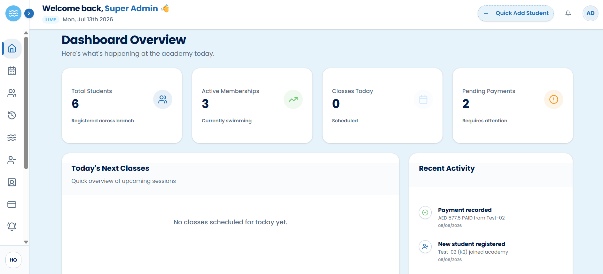
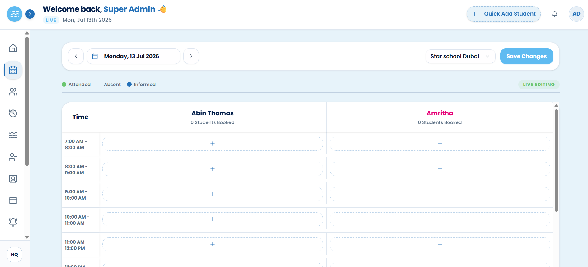
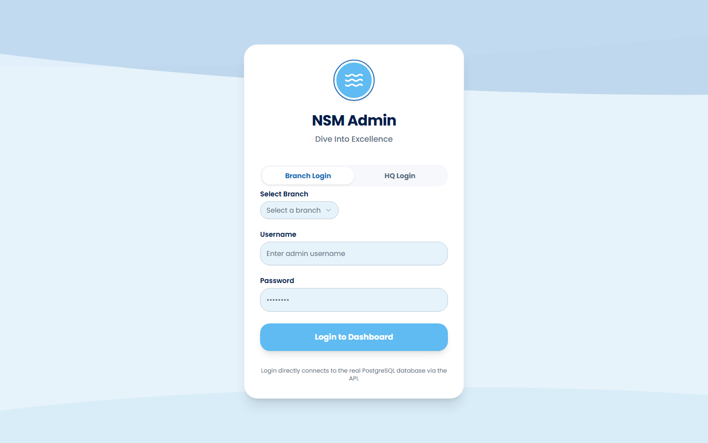
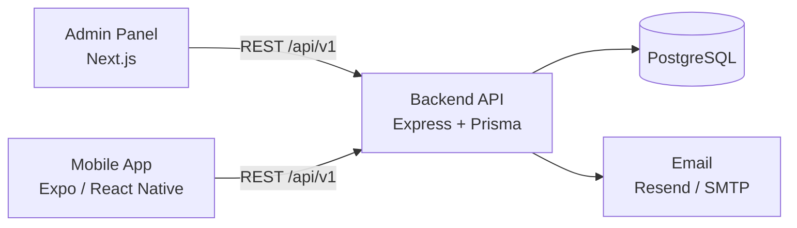

# NSM Swimming Academy 🏊

A full-stack management platform for a multi-branch swimming academy — covering student registration, scheduling, attendance, payments, and reporting in one system, with a web admin panel for staff and a mobile app for students.

**[Live admin panel →](https://nsm-swimming-academy.vercel.app)**



<details>
<summary>More screenshots</summary>





</details>

## The problem

Swimming academies with multiple branches typically juggle spreadsheets, WhatsApp groups, and paper receipts to track who is enrolled, who paid, who showed up, and which time slots are full. This project replaces that with a single source of truth: branch-scoped data, role-based access for staff, automated reminders, and self-service access for students on mobile.

## Architecture

Monorepo with three apps sharing one REST API:

```
NSM-Swimming-Academy/
├── backend/       Express 5 + TypeScript + Prisma REST API (PostgreSQL)
├── admin-panel/   Next.js 16 web dashboard for academy staff
└── mobile-app/    Expo (React Native) app for students
```



## Features

- **Multi-branch management** — every record is scoped to a branch; super admins see across branches, staff only see their own
- **Role-based access control** — `SUPER_ADMIN` / `STAFF` roles enforced by middleware, JWT auth with refresh-token rotation
- **Student lifecycle** — registration, membership history, freezing, cancellation (with refund tracking), and expiry handling
- **Scheduling & attendance** — time-slot schedules with per-slot capacity limits, coach assignments, and attendance records
- **Payments & finance** — payments with installment plans, PDF invoice generation, expense tracking, and Excel report exports
- **Notifications & reminders** — in-app and email notifications (Resend or SMTP), cron-driven reminders, and real-time updates over Server-Sent Events
- **API documentation** — interactive Swagger UI at `/api-docs`
- **Hardened API** — Zod request validation, rate limiting, Helmet security headers, Winston logging, and activity audit logs

## Tech stack

| Layer | Technology |
|---|---|
| Backend | Node.js, Express 5, TypeScript, Prisma ORM, PostgreSQL, Zod, JWT |
| Admin panel | Next.js 16, React 19, Tailwind CSS 4, shadcn/ui, Axios |
| Mobile app | Expo SDK 54, React Native, expo-router |
| Infra | Docker (multi-stage build), Railway, Neon (PostgreSQL) |

## Getting started

### Prerequisites

- Node.js 20+
- A PostgreSQL database (local, or a free [Neon](https://neon.tech) instance)

### 1. Backend

```bash
cd backend
cp .env.example .env        # fill in DATABASE_URL, JWT secrets, email provider
npm install
npx prisma migrate dev      # create the schema
npx prisma db seed          # seed initial data
npm run dev                 # http://localhost:5000, docs at /api-docs
```

### 2. Admin panel

```bash
cd admin-panel
npm install
npm run dev                 # http://localhost:3000
```

Set `NEXT_PUBLIC_API_URL` if the API isn't on `http://localhost:5000/api/v1`.

### 3. Mobile app

```bash
cd mobile-app
npm install
npx expo start              # scan the QR code with Expo Go
```

On a physical device, set `EXPO_PUBLIC_API_URL` to your machine's LAN IP (e.g. `http://192.168.1.x:5000/api/v1`).

## Deployment

The backend ships with a multi-stage `Dockerfile` and `railway.toml` for one-click deployment on [Railway](https://railway.app). The admin panel deploys anywhere Next.js runs (e.g. Vercel); the mobile app builds with [EAS](https://expo.dev/eas).

## License

MIT
